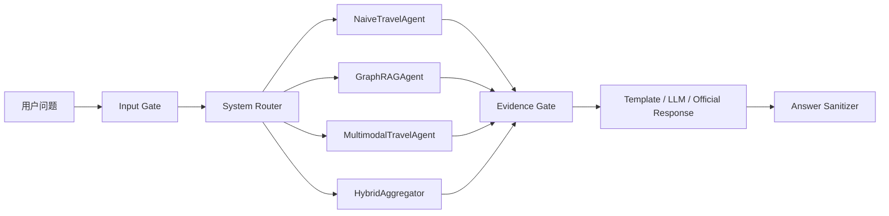

# 架构说明

## 总体流程

系统采用统一边界：

`输入门禁 → 路由 → 检索 → 证据门禁 → 回答生成 → 输出清洗`

检索完成并不等于可以回答。只有目的地、核心实体和问题意图得到有效证据覆盖，
结果才能进入回答生成。

## SystemAgent

SystemAgent 负责输入合法性检查、路由和子 Agent 编排。

- 空白、纯标点、无语义问候或随机乱码直接返回 `invalid_input`。
- `/api/route` 只返回路由，不执行检索或生成。
- Global Search 请求开关不参与路由，只影响已经进入 GraphRAG 分支后的检索优先级。
- 规则 Router 是默认路径；配置开启后可以调用 LLM Router，但规则边界仍作为护栏。

## NaiveTravelAgent

NaiveTravelAgent 处理中国大陆单一旅行范围内的详细问题：

- 怎么玩、半天游、几日游和单域路线；
- 交通、住宿、美食、景点和打卡推荐；
- 同一目的地范围内的景点比较。

检索优先使用 FAISS，缺少 embedding 配置或索引不可用时回退 CSV。检索结果必须覆盖
目的地和意图，住宿证据不能替代玩法证据。

默认关闭普通 LLM 时，答案由确定性模板整理，因此速度较快。开启
`TRAVELMIND_LLM_GENERATE_ENABLED` 后，LLM 只消费通过 Evidence Gate 的证据。

## GraphRAGAgent

GraphRAGAgent 处理跨目的地比较、多目的地路线、主题归纳和实体关系问题。

正式检索顺序：

1. 请求与服务双授权时，先尝试 Official Global Search。
2. 尝试 Official Local Search。
3. 失败后降级为本地 GraphRAG 产物证据预览。
4. 最后进入安全 wrapper。

Official Local 和 Global 都必须通过回答非空、核心实体覆盖和来源摘要门禁。
证据预览与 wrapper 不会伪装成正式 GraphRAG 回答。

## MultimodalTravelAgent

MultimodalTravelAgent 服务香港、澳门和台湾相关问题。其知识源是旅游 PDF 经离线模型
处理后形成的 Markdown 文档，以及基于这些文档构建的 FAISS 索引。

在线问答阶段：

- 不执行 OCR；
- 不调用在线视觉模型；
- 优先尝试 Markdown 向量检索；
- 向量配置或元数据不满足要求时回退 canonical Markdown 关键词检索；
- 区域或主题不匹配时拒绝生成具体建议。

这里的“Multimodal”表示知识资产来自离线多模态文档处理流程，不代表每次问答都会实时
解析图片或 PDF。

## HybridAggregator

大陆与港澳台并存的问题进入 HybridAggregator。

- GraphRAG 与 Multimodal 分支并行执行。
- 每个分支受独立超时预算约束。
- 仅聚合通过 Evidence Gate 的候选。
- 单分支有效时返回 `hybrid_partial_fallback`。
- 两个分支均无有效证据时不调用 Generate。
- 当前语义是“多源候选聚合”，不声明深度融合。

## 回答生成与状态

回答生成模式包括：

- `template`：确定性模板；
- `llm`：普通 TravelMind LLM；
- `official_response`：官方 GraphRAG Local/Global 响应；
- `none`：证据不足或无需生成。

最终 Answer Sanitizer 会移除 GraphRAG 内部表名、内部 ID 和调试引用，但保留普通
Markdown、时间、金额和景点编号。
